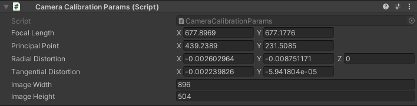

# ArUcoDetectionHoloLens-Unity
**Edit 1/30/2022**: If you are interested in testing out our improved repo for tracking and display calibration on the HoloLens 2, please check out our [display-calibration-hololens](https://github.com/doughtmw/display-calibration-hololens) repository.

ArUco marker tracking made available for use in Unity through [IL2CPP Windows Runtime support](https://docs.unity3d.com/2018.4/Documentation/Manual/IL2CPP-WindowsRuntimeSupport.html) for the HoloLens 1 (x86) and HoloLens 2 (ARM). 

Incorporates:
- [HoloLensForCV](https://github.com/microsoft/HoloLensForCV) sample from Microsoft, at personal [branch](https://github.com/doughtmw/HoloLensForCV/)
- [ArUco marker detection](https://docs.opencv.org/4.1.1/d5/dae/tutorial_aruco_detection.html) in OpenCV


## Requirements
- Tested with [Unity 2018.4 LTS and Unity 2019.4 LTS](https://unity3d.com/unity/qa/lts-releases
)
- [Visual Studio 2017/2019](https://visualstudio.microsoft.com/downloads/)
- Minimum [RS4](https://docs.microsoft.com/en-us/windows/mixed-reality/release-notes-april-2018), tested with [OS Build 17763.678](https://support.microsoft.com/en-ca/help/4511553/windows-10-update-kb4511553)
- Printed (or on screen) ArUco markers. Markers can be readily generated using the following [tool](http://chev.me/arucogen/)

## ArUco Detection Sample
1. Git clone repo. From the main project directory, clone submodules with: 
```
git submodule update --init
``` 
*Optional: build project from source*
- Open HoloLensForCV sample in VS2017/VS2019 and install the `OpenCV.HoloLens.3411` NuGet package to HoloLensForCV project. In Nuget package manager console type:
```
Install-Package ..\OpenCV.HoloLens.3411.0.0.nupkg -ProjectName HoloLensForCV
```
-  Build the HoloLensForCV project (x86 OR ARM, Debug or Release) 
- Copy all output files from HoloLensForCV output path (dlls and HoloLensForCV.winmd) to the Assets->Plugins->x86/ARM folder of the ArUcoDetectionHoloLensUnity project

2. Open ArUcoDetectionHoloLensUnity Unity project and build using IL2CPP, ensure that unsafe code is allowed under Unity Player Settings->Other Settings
3. Open VS solution, build then deploy to device
4. When looking at an aruco marker **from the correct ArUco dictionary**: this sample uses the ```6x6 (50, 100, 250, 500) dictionary``` by default, a virtual cube, which is scaled to the size of the ArUco marker, should appear on top of the marker

## Camera calibration for the HoloLens 2 
- To improve the accuracy of marker-based registration, it is recommended that a standard camera calibration procedure is performed (estimating the intrinsic and extrinsic parameters of the camera)
  - This estimation procedure only has to be performed once per camera and requires the user to capture multiple images of a standard planar calibration chessboard from different orientations
- Details of how to record images from your HoloLens 2 camera (at the desired resolution for marker-based tracking) and compute the calibration parameters are included in the [following README file](https://github.com/doughtmw/HoloLensCamCalib)
- After computing the camera parameters, we can open the resulting `data.json` file and extract relevant measures to include in the Unity project for online tracking 
- Below is a sample `json` file from one of my calibration results

```json
// Calibration parameters from opencv, compute once for each hololens 2 device
{"camera_matrix": [[677.8968352717175, 0.0, 439.2388714449508], [0.0, 677.1775976226464, 231.50848952714483], [0.0, 0.0,1.0]], "dist_coeff": [[-0.002602963842533594, -0.008751170499511022, -0.0022398259556777236, -5.941804169976817e-05, 0.0]], "height": 504, "width": 896}
```
- From this file we can parse important values as follows and enter them into the corresponding Unity fields in the `ArUcoDetectionHoloLensUnity` project
- On runtime, these values will be used within the `HoloLensForCV` project to remove distortion from the incoming video data and improve the accuracy of marker-based tracking
```c#
// Proper format parameters for Unity
  677.8968352717175f, 677.1775976226464f, // focal length (0,0) & (1,1)
  439.2388714449508f, 231.50848952714483f, // principal point (0,2) & (2,2)
  -0.002602963842533594f, -0.008751170499511022f, 0.0f, // radial distortion (0,0) & (0,1) & (0,4)
  -0.0022398259556777236f, -5.941804169976817e-05f, // tangential distortion (0,2) & (0,3)
  504, 896); // image width and height
```


## Using other research mode sensor streams - HoloLens 1 only...
To enable the use of [HoloLens research mode streams](https://docs.microsoft.com/en-us/windows/mixed-reality/research-mode) in Unity, additional permissions are required for the project. Navigate to Unity project build folder and modify the Package.appxmanifest file to include: 
- Restricted capabilities package:
```xml 
<Package 
  xmlns:mp="http://schemas.microsoft.com/appx/2014/phone/manifest" 
  xmlns:uap="http://schemas.microsoft.com/appx/manifest/uap/windows10" 
  xmlns:uap2="http://schemas.microsoft.com/appx/manifest/uap/windows10/2" 
  xmlns:uap3="http://schemas.microsoft.com/appx/manifest/uap/windows10/3" 
  xmlns:uap4="http://schemas.microsoft.com/appx/manifest/uap/windows10/4" 
  xmlns:iot="http://schemas.microsoft.com/appx/manifest/iot/windows10" 
  xmlns:mobile="http://schemas.microsoft.com/appx/manifest/mobile/windows10" 
  xmlns:rescap="http://schemas.microsoft.com/appx/manifest/foundation/windows10/restrictedcapabilities" 
  IgnorableNamespaces="uap uap2 uap3 uap4 mp mobile iot rescap" 
  xmlns="http://schemas.microsoft.com/appx/manifest/foundation/windows10"> 
```
- Modified capabilities with with new package:
```xml
  <Capabilities>
    <rescap:Capability Name="perceptionSensorsExperimental" />
    <Capability Name="internetClient" />
    <Capability Name="internetClientServer" />
    <Capability Name="privateNetworkClientServer" />
    <uap2:Capability Name="spatialPerception" />
    <DeviceCapability Name="webcam" />
  </Capabilities>
```

Now, modifying the selected sensor for streaming in Unity (for depth and infrared streams, more processing of input frames will likely be required to visualize) different streams can be selected. ArUco marker tracking is currently only supported using the photo-video camera of the HoloLens 1 and HoloLens 2.


